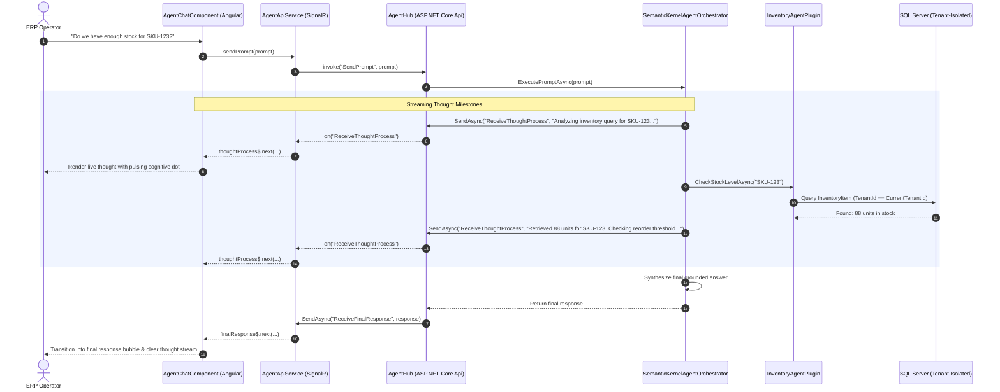

# Smart ERP Agent (B2B SaaS Multi-Agent Automation Platform)

[](https://dotnet.microsoft.com/)
[](https://angular.dev/)
[](https://nx.dev/)
[](https://learn.microsoft.com/en-us/semantic-kernel/)
[](https://dotnet.microsoft.com/apps/aspnet/signalr)
[](https://learn.microsoft.com/en-us/ef/core/)
[](https://github.com/github/spec-kit)

**Smart ERP Agent** is an enterprise-grade B2B SaaS multi-agent automation platform designed using the **4+1 Architectural View Model**. It combines a decoupled **ASP.NET Core 8 Web API** (Clean Architecture), **Microsoft SQL Server** with strict multi-tenant isolation, **Microsoft Semantic Kernel** for autonomous AI planning, real-time **ASP.NET Core SignalR WebSockets** for live thought streaming, and an **Nx Monorepo with Angular 19+** modular workspace libraries.

---

## 🏛️ Architectural Overview (4+1 View Model)

```mermaid
flowchart TB
    subgraph UseCaseView["Use Case View (+1)"]
        UC1["Tenant Management & Multi-Tenancy"]
        UC2["Invoice Generation & Receivable Tracking"]
        UC3["Inventory Control & Threshold Alerting"]
        UC4["Autonomous Agent Decision & Tool Execution"]
        UC5["Real-Time AI Thought Process Streaming"]
    end

    subgraph LogicalView["Logical View (Clean Architecture)"]
        Core["SmartErpAgent.Core\n(Entities: Tenant, Invoice, InventoryItem)"]
        App["SmartErpAgent.Application\n(IApplicationDbContext, IAgentOrchestrator, AgentHub)"]
        Infra["SmartErpAgent.Infrastructure\n(ApplicationDbContext, SQL Server, Global Filters)"]
        Agent["SmartErpAgent.AgentEngine\n(Semantic Kernel, InvoicePlugin, InventoryPlugin)"]
        Api["SmartErpAgent.Api\n(Controllers, AgentHub, MultiTenantMiddleware)"]

        Api --> App
        Api --> Infra
        Api --> Agent
        Infra --> App
        Infra --> Core
        Agent --> App
        Agent --> Core
        App --> Core
    end

    subgraph ProcessView["Process View (Runtime Execution)"]
        Req["HTTP Request + X-Tenant-ID"] --> MTM["MultiTenantMiddleware"]
        MTM --> TC["ITenantContext (Scoped)"]
        TC --> CT["Controllers / Endpoints"]
        CT --> DBF["EF Core Global Query Filter\n(TenantId == CurrentTenantId)"]
        
        Prompt["WebSocket Prompt (/hubs/agent)"] --> Hub["AgentHub"]
        Hub --> SK["Semantic Kernel Agent Orchestrator"]
        SK -- "ReceiveThoughtProcess (Streaming)" --> UIStream["Angular UI Thought Stream"]
        SK --> DBF
        SK -- "ReceiveFinalResponse" --> UIFinal["Completed Chat Bubble"]
    end

    subgraph PhysicalView["Physical & Deployment View"]
        ClientSPA["Angular SPA (apps/smart-erp-web)\n[Port 4200]"]
        BackendAPI["ASP.NET Core Web API (Kestrel)\n[Port 5000 / 5001]"]
        DB[(Microsoft SQL Server 2022\n[Port 1433])]
        LLM["OpenAI / Azure OpenAI\n(Semantic Kernel Connector)"]

        ClientSPA -- "HTTP REST & SignalR WebSockets" --> BackendAPI
        BackendAPI -- "EF Core TDS" --> DB
        BackendAPI -- "REST / SDK" --> LLM
    end
```

---

## ⚡ Real-Time Thought Process Streaming Flow

When an enterprise operator submits an inquiry, the system streams cognitive reasoning steps dynamically to the UI before synthesizing the final response:



---

## 📁 Repository Structure

```text
SmartERPAgent/
├── .specify/                                   # GitHub Spec Kit configuration & constitution
│   ├── memory/constitution.md                  # Non-negotiable architectural constitution
│   └── templates/                              # Spec-Driven Development templates
│
├── frontend/                                   # Nx Monorepo (Angular 19+)
│   ├── apps/
│   │   └── smart-erp-web/                      # Angular Host Dashboard Application
│   │       └── src/app/                        # Host layout, SSR server & shell
│   ├── libs/                                   # Modular Shared Workspace Libraries
│   │   ├── shared/data-access/                 # @smart-erp/data-access (SignalR AgentApiService, TenantService, Models)
│   │   ├── shared/ui/                          # @smart-erp/ui (BadgeComponent, TenantSelectorComponent)
│   │   └── agents/feature-chat/                # @smart-erp/feature-chat (AgentChatComponent with thought streaming UI)
│   ├── nx.json
│   ├── package.json
│   └── tsconfig.base.json                      # Strict TypeScript settings (noImplicitOverride, strict)
│
├── backend/                                    # ASP.NET Core 8 Web API Solution
│   ├── SmartErpAgent.sln
│   ├── src/
│   │   ├── SmartErpAgent.Core/                 # Domain Entities (Tenant, Invoice, InventoryItem, BaseEntity)
│   │   ├── SmartErpAgent.Application/          # Contracts (IApplicationDbContext, IAgentOrchestrator, AgentHub)
│   │   ├── SmartErpAgent.Infrastructure/       # EF Core 8 SQL Server, Global Query Filters, Interceptors
│   │   ├── SmartErpAgent.AgentEngine/          # Microsoft Semantic Kernel, Native Plugins (Inventory, Invoice)
│   │   └── SmartErpAgent.Api/                  # Web API, SignalR AgentHub (/hubs/agent), MultiTenantMiddleware
│   └── tests/
│       └── SmartErpAgent.UnitTests/            # xUnit tests (TenantIsolationTests, AgentEngineTests, AgentControllerTests)
│
└── specs/                                      # Spec Kit Specifications
    ├── 001-ef-core-multitenancy/               # Feature 001: Multi-tenant EF Core isolation
    ├── 002-ai-agent-orchestration/             # Feature 002: Semantic Kernel plugins
    ├── 003-agent-chat-api/                     # Feature 003: Agent Chat REST Controller
    ├── 004-frontend-agent-chat/                # Feature 004: Angular Feature Chat Component
    └── 005-signalr-thought-streaming/          # Feature 005: Real-Time SignalR Thought Streaming
```

---

## 🚀 Getting Started

### Prerequisites
- [.NET 8.0 SDK](https://dotnet.microsoft.com/download/dotnet/8.0)
- [Node.js 20+ / npm 10+](https://nodejs.org/)
- [Microsoft SQL Server 2022](https://www.microsoft.com/en-us/sql-server) or Docker container

---

### 1. Database & Backend API Setup

1. **Configure Connection String**:
   Update `backend/src/SmartErpAgent.Api/appsettings.json` with your SQL Server connection details:
   ```json
   "ConnectionStrings": {
     "DefaultConnection": "Server=localhost,1433;Database=SmartErpAgentDb;User Id=sa;Password=Your_password123;TrustServerCertificate=True;MultipleActiveResultSets=true;"
   }
   ```

2. **Run Migrations & Start Backend API**:
   ```bash
   cd backend
   dotnet run --project src/SmartErpAgent.Api/SmartErpAgent.Api.csproj
   ```
   - **Swagger UI**: [https://localhost:5001/swagger](https://localhost:5001/swagger) (or `http://localhost:5000/swagger`)
   - **SignalR Hub Endpoint**: `http://localhost:5000/hubs/agent`

---

### 2. Frontend Angular Dashboard Setup

1. **Install Dependencies**:
   ```bash
   cd frontend
   npm install
   ```

2. **Start the Development Server**:
   ```bash
   npx nx serve smart-erp-web
   ```
   - **Dashboard URL**: [http://localhost:4200](http://localhost:4200)

3. **Production & SSR Build**:
   ```bash
   npx nx build smart-erp-web
   ```

---

### 3. Running Automated Test Suites

```bash
# Run all backend unit and integration tests (18 tests)
dotnet test backend/SmartErpAgent.sln
```

All 18 automated tests cover:
- **Tenant Isolation**: EF Core global query filters preventing cross-tenant data leakage.
- **AI Plugins**: Inventory SKU stock checks and low-stock threshold alerting.
- **SignalR Real-Time Streaming**: Orchestrator thought streaming and hub invocation dispatching.

---

## 📡 API & WebSocket Hub Contracts

### SignalR WebSocket Hub: `/hubs/agent`

| Invocation / Event | Direction | Payload | Description |
|---|---|---|---|
| `SendPrompt` | Client ➔ Hub | `prompt: string` | Dispatches inquiry to the Semantic Kernel agent orchestrator |
| `ReceiveThoughtProcess` | Hub ➔ Client | `thought: string` | Real-time stream of planner reasoning steps and tool execution milestones |
| `ReceiveFinalResponse` | Hub ➔ Client | `response: string` | Final synthesized conversational reply delivered to the chat UI |

### REST Endpoints

| Method | Route | Headers | Description |
|---|---|---|---|
| `POST` | `/api/agent/chat` | `X-Tenant-ID: <GUID>` | Synchronous fallback chat endpoint |
| `GET` | `/api/inventory` | `X-Tenant-ID: <GUID>` | Lists tenant-filtered inventory items |
| `GET` | `/api/invoices` | `X-Tenant-ID: <GUID>` | Lists tenant-filtered invoices |
| `GET` | `/api/tenants` | — | Retrieves registered multi-tenant organizations |

---

## 📐 Spec-Driven Development (GitHub Spec Kit)

This repository strictly enforces **Spec-Driven Development (SDD)** with **GitHub Spec Kit** and the **Platform Constitution** (`.specify/memory/constitution.md`).

### Spec Kit Commands
- `/speckit-constitution`: Review or amend core architectural governance principles.
- `/speckit-specify`: Generate requirements and user journeys from intent.
- `/speckit-plan`: Create an implementation plan with architectural validation.
- `/speckit-tasks`: Break down the plan into ordered, test-driven checklist items.
- `/speckit-implement`: Autonomous execution of tasks according to the specification.
- `/speckit-converge`: Strict audit of the codebase against specs, closing implementation gaps.

---

## 📜 License

MIT License. Copyright (c) 2026 M Ashiqur Rahman.
