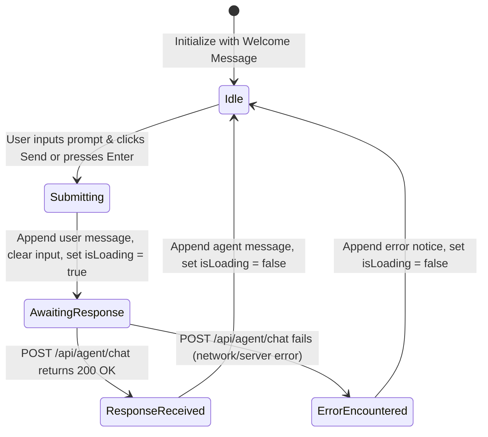

# Data Model & DTOs: Angular Agent Chat Interface

**Feature**: `004-frontend-agent-chat`  
**Date**: 2026-09-05  
**Spec**: [specs/004-frontend-agent-chat/spec.md](./spec.md)

---

## 1. Frontend Domain Models (`libs/shared/data-access`)

Defined in `frontend/libs/shared/data-access/src/lib/models/agent.model.ts`:

### `ChatMessage`
Represents an individual message exchanged in the chat session.

```typescript
export interface ChatMessage {
  id: string;
  role: 'user' | 'agent';
  content: string;
  timestamp: Date;
}
```

#### Field Specifications:
- `id`: Unique identifier (string, e.g., generated timestamp or UUID).
- `role`: Originator of the message. `'user'` for messages submitted by the client; `'agent'` for responses returned by the Semantic Kernel orchestrator.
- `content`: Plain text body of the inquiry or response.
- `timestamp`: JavaScript `Date` instance when the message was posted or received.

---

### `AgentChatRequest`
Data Transfer Object sent in the POST body to `/api/agent/chat`.

```typescript
export interface AgentChatRequest {
  prompt: string;
}
```

#### Validation Rules:
- `prompt`: String, non-empty, must contain at least 1 non-whitespace character before submission.

---

### `AgentChatResponse`
Payload returned by the backend API (`SmartErpAgent.Api`).

```typescript
export interface AgentChatResponse {
  response: string;
}
```

---

## 2. Component State Model (`libs/agents/feature-chat`)

Managed internally by `AgentChatComponent`:

| Property | Type | Default | Description |
| :--- | :--- | :--- | :--- |
| `messages` | `ChatMessage[]` | Initial welcome message | Array of chat turns displayed in chronological order |
| `isLoading` | `boolean` | `false` | Indicates whether a response from the backend agent is in flight |
| `userPrompt` | `string` | `''` | Current text bound to the input element |

---

## 3. UI State Transitions



- **Idle**: Submit button and input field are enabled.
- **Submitting / AwaitingResponse**: Submit button and input field are disabled. Typing indicator is visible in the message stream.
- **ResponseReceived / ErrorEncountered**: Typing indicator disappears. Input field is focused and enabled.
