# Data Model & Streaming Events: Real-Time SignalR Agent Communication

**Feature**: `005-signalr-thought-streaming`  
**Date**: 2026-09-05  
**Spec**: [specs/005-signalr-thought-streaming/spec.md](./spec.md)

---

## 1. Backend Hub Event Payloads

### `ReceiveThoughtProcess` Event Payload
Emitted by `SemanticKernelAgentOrchestrator` through `IHubContext<AgentHub>` to notify the client of planning milestones and tool execution progress:

```csharp
// Method Name: "ReceiveThoughtProcess"
// Argument: string message
"Inspecting warehouse stock levels for SKU 'SKU-123' via InventoryAgentPlugin..."
```

### `ReceiveFinalResponse` Event Payload
Emitted by the hub or returned when the agent orchestrator completes its reasoning and tool invocations:

```csharp
// Method Name: "ReceiveFinalResponse"
// Argument: string response
"Product 'Precision Ball Bearing' (SKU: SKU-123) has 120 units in stock."
```

---

## 2. Frontend Reactive Data Models (`libs/shared/data-access`)

Defined in `frontend/libs/shared/data-access/src/lib/models/agent.model.ts`:

### Streaming Thought State
```typescript
export interface ThoughtProcessUpdate {
  message: string;
  timestamp: Date;
}

export interface ChatMessage {
  id: string;
  role: 'user' | 'agent';
  content: string;
  thoughtProcess?: string;
  timestamp: Date;
}
```

---

## 3. Real-Time UI State Transitions

```mermaid
stateDiagram-v2
    [*] --> Disconnected
    Disconnected --> Connected: startConnection()
    Connected --> PromptDispatched: User clicks Send or presses Enter
    PromptDispatched --> StreamingThoughts: Backend begins planning; emits ReceiveThoughtProcess
    StreamingThoughts --> StreamingThoughts: New intermediate planner/tool events arrive
    StreamingThoughts --> Completed: Final response received via ReceiveFinalResponse
    Completed --> Connected: Append final message bubble, clear active thought, re-enable input
    Connected --> Reconnecting: Socket disconnects
    Reconnecting --> Connected: Auto-reconnected
```



- **PromptDispatched / StreamingThoughts**: Input field and submit button disabled. Dynamic italicized thought text displayed with pulsing brain/cog indicator beneath active user prompt.
- **Completed**: Thought process freezes or folds into message metadata; final agent response bubble rendered. Controls re-enabled.
