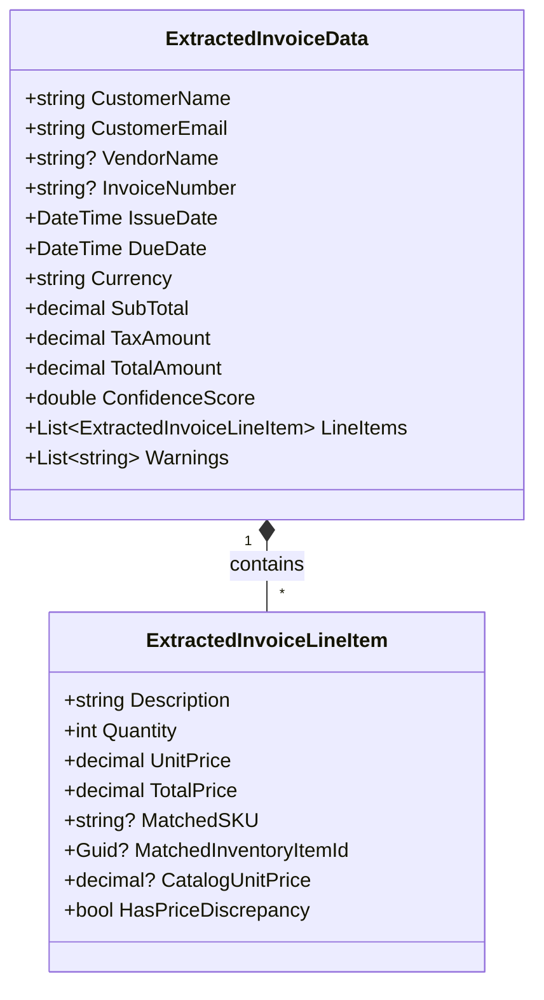
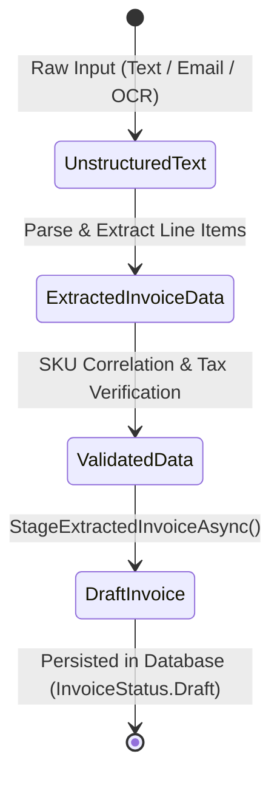

# Data Model: Invoice Extractor & Document Intelligence Plugin

**Feature**: `006-invoice-extractor-plugin`  
**Date**: 2026-09-05  
**Status**: Completed

---

## 1. DTO & In-Memory Extraction Models

### `ExtractedInvoiceData`
Represents the structured result of an invoice document extraction before it is committed to the database.

| Property | Type | Description |
|---|---|---|
| `CustomerName` | `string` | Extracted customer or billing client name |
| `CustomerEmail` | `string` | Extracted customer email address |
| `VendorName` | `string?` | Optional vendor/issuer business name |
| `InvoiceNumber` | `string?` | Original invoice/bill reference number |
| `IssueDate` | `DateTime` | Extracted or defaulted invoice issue date (UTC) |
| `DueDate` | `DateTime` | Extracted or calculated due date (UTC) |
| `Currency` | `string` | 3-letter currency code (e.g. "USD") |
| `SubTotal` | `decimal` | Sum of all line item totals |
| `TaxAmount` | `decimal` | Calculated or extracted sales tax |
| `TotalAmount` | `decimal` | Grand total (`SubTotal + TaxAmount`) |
| `ConfidenceScore` | `double` | 0.0 to 1.0 confidence score of extraction |
| `LineItems` | `List<ExtractedInvoiceLineItem>` | Collection of individual line items |
| `Warnings` | `List<string>` | Discrepancy notices (e.g. price mismatch, missing dates) |

### `ExtractedInvoiceLineItem`
Represents an individual extracted item or service.

| Property | Type | Description |
|---|---|---|
| `Description` | `string` | Product name or service description |
| `Quantity` | `int` | Units billed (minimum 1) |
| `UnitPrice` | `decimal` | Price per unit |
| `TotalPrice` | `decimal` | Line total (`Quantity * UnitPrice`) |
| `MatchedSKU` | `string?` | Correlated SKU from inventory catalog (if matched) |
| `MatchedInventoryItemId` | `Guid?` | Foreign key to `InventoryItem.Id` (if matched) |
| `CatalogUnitPrice` | `decimal?` | Active catalog price from inventory (for comparison) |
| `HasPriceDiscrepancy` | `bool` | True if unit price differs significantly from catalog |

---

## 2. Entity Mappings & State Transitions

### Database Persistence Entity: `Invoice` & `InvoiceLineItem`
- `Invoice`:
  - `TenantId`: Scoped to active tenant (`ITenantContext.CurrentTenantId`).
  - `Status`: Always initiated as `InvoiceStatus.Draft` (Value = 0).
  - `InvoiceNumber`: Autogenerated sequential code `INV-{yyyyMM}-{0001}`.
  - `CreatedAtUtc`: UTC timestamp.
- `InvoiceLineItem`:
  - `InvoiceId`: Foreign key to parent `Invoice`.
  - `InventoryItemId`: Linked to matched `InventoryItem.Id` (or null if custom non-inventory item).
  - `Quantity`, `UnitPrice`, `TotalPrice`: Populated from validated line item.
