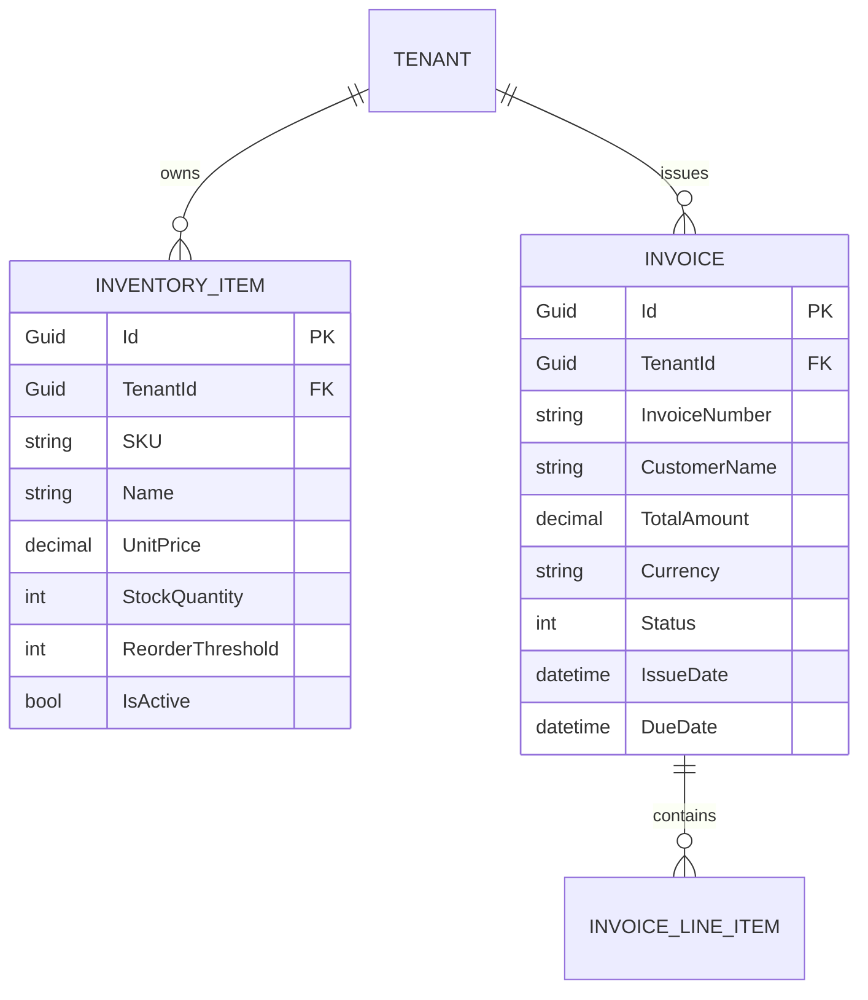

# Phase 1 Data Model: Executive Business Intelligence Reporting

**Feature**: `007-reporting-agent-plugin`  
**Date**: 2026-09-05  
**Domain Layer**: `SmartErpAgent.Application.DTOs` & `SmartErpAgent.AgentEngine.Plugins`

---

## 1. Domain Entities & Context (Read-Only Projections)

This feature performs read-only analytical queries across existing core entities without altering the database schema:



---

## 2. Reporting DTOs & Analytical Records

### A. Inventory Item Valuation Record
Represents an individual SKU's contribution to warehouse asset value:
```csharp
namespace SmartErpAgent.Application.DTOs;

public record TopValuableSkuDto(
    string SKU,
    string Name,
    int StockQuantity,
    decimal UnitPrice,
    decimal TotalItemValue
);
```

### B. Inventory Valuation Report DTO
Aggregated financial snapshot of the current tenant's warehouse stock:
```csharp
namespace SmartErpAgent.Application.DTOs;

public record InventoryValuationReportDto(
    decimal TotalValuation,
    int TotalActiveSkuCount,
    int TotalUnitsInStock,
    IReadOnlyList<TopValuableSkuDto> TopValuableSkus
);
```

### C. Time-Bounded Financial Summary DTO
Aggregated revenue and volume metrics over an evaluated time window:
```csharp
namespace SmartErpAgent.Application.DTOs;

public record FinancialPeriodSummaryDto(
    int PeriodDays,
    DateTime StartDateUtc,
    DateTime EndDateUtc,
    decimal TotalRevenue,
    int InvoiceCount,
    string Currency
);
```

---

## 3. Validation & Business Constraints

| Field / Property | Rule | Enforcement Level |
| :--- | :--- | :--- |
| `days` (in `GetFinancialSummaryAsync`) | Must be positive integer $\ge 1$. If $\le 0$, automatically normalized to 30. | Method Parameter Validation |
| Multi-Tenant Scope | Must query strictly within `CurrentTenantId`. | EF Core Global Query Filter |
| Soft-Deleted Records | Must exclude `IsDeleted == true`. | EF Core Global Query Filter |
| Inactive Inventory | Must exclude `IsActive == false` from valuation calculations. | LINQ `.Where(i => i.IsActive)` |
| Top Items Count | Capped at maximum 3 items, ordered by `TotalItemValue DESC`, `SKU ASC`. | LINQ `.Take(3)` |
