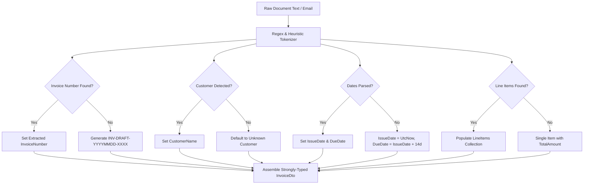

# Data Model: Invoice Extractor Plugin (Document Intelligence to InvoiceDto)

**Feature Branch**: `008-invoice-extractor-plugin`  
**Date**: 2026-09-05  
**Status**: Completed

---

## 1. Primary Entities & DTOs

### `InvoiceDto`
Represents the structured invoice output returned by `ExtractInvoiceDetailsAsync`.

| Field | Type | Required | Description | Extraction Strategy |
| :--- | :--- | :--- | :--- | :--- |
| `Id` | `Guid` | Yes | Unique draft invoice identifier | Auto-generated (`Guid.NewGuid()`) |
| `TenantId` | `Guid` | Yes | Scoped tenant organization GUID | Current tenant context or `Guid.Empty` |
| `InvoiceNumber` | `string` | Yes | Alphanumeric invoice identifier | Regex: `(?:invoice\s*#?[:\s-]*|inv[:\s#-]*)([A-Za-z0-9_-]+)` |
| `CustomerName` | `string` | Yes | Customer or client entity name | Regex: `(?:bill\s*to|customer|client)[:\s]+([^\r\n,;]+)` |
| `CustomerEmail` | `string` | No | Customer contact email address | Standard email regex pattern |
| `IssueDate` | `DateTime` | Yes | Date invoice was generated | Regex date match or defaults to `DateTime.UtcNow` |
| `DueDate` | `DateTime` | Yes | Date payment is expected | Regex due date match or `IssueDate.AddDays(14)` |
| `SubTotal` | `decimal` | Yes | Net total before tax | Sum of extracted line items or `TotalAmount` |
| `TaxAmount` | `decimal` | Yes | Extracted or calculated tax | Extracted tax regex or `TotalAmount - SubTotal` |
| `TotalAmount` | `decimal` | Yes | Gross invoice total amount | Regex: `(?:total|amount\s*due)[:\s]*[\$€£]?\s*([0-9,]+\.[0-9]{2})` |
| `Currency` | `string` | Yes | ISO currency code (e.g., USD) | Currency symbol / token detection (default `USD`) |
| `Status` | `InvoiceStatus` | Yes | Workflow status (`Draft`) | Defaults to `InvoiceStatus.Draft` |
| `Notes` | `string?` | No | Extraction metadata / warnings | Document source notes, extraction confidence notes |
| `LineItems` | `List<InvoiceLineItemDto>`| Yes | Extracted line item rows | Tabular or multi-line item regex extraction |

---

### `InvoiceLineItemDto`
Represents individual product or service items parsed from the document body.

| Field | Type | Required | Description | Extraction Strategy |
| :--- | :--- | :--- | :--- | :--- |
| `Id` | `Guid` | Yes | Line item identifier | `Guid.NewGuid()` |
| `InventoryItemId` | `Guid?` | No | Linked tenant catalog item (if matched) | Optional SKU lookup or `null` |
| `Description` | `string` | Yes | Item or service description | Regex item description capture |
| `Quantity` | `int` | Yes | Billed units/quantity | Numeric integer match (defaults to 1) |
| `UnitPrice` | `decimal` | Yes | Unit price per item | Price match per line |
| `TotalPrice` | `decimal` | Yes | Computed line total (`Quantity * UnitPrice`) | Computed or matched line total |

---

## 2. Extraction Mapping & Fallback Rules

---

## 3. Validation & Boundary Constraints
- `TotalAmount` must be non-negative.
- `Quantity` must be greater than 0.
- Dates default to UTC to eliminate timezone ambiguities.
