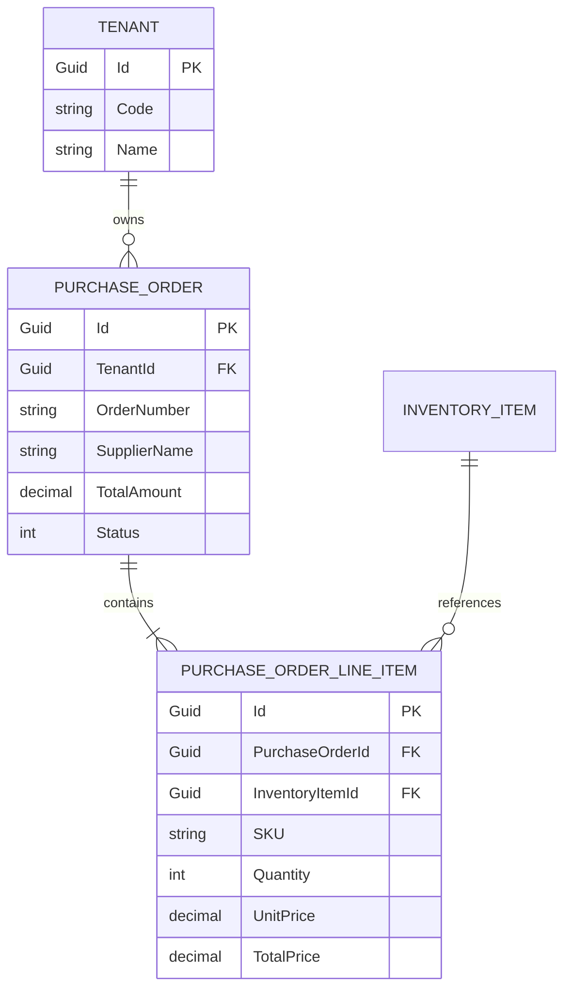
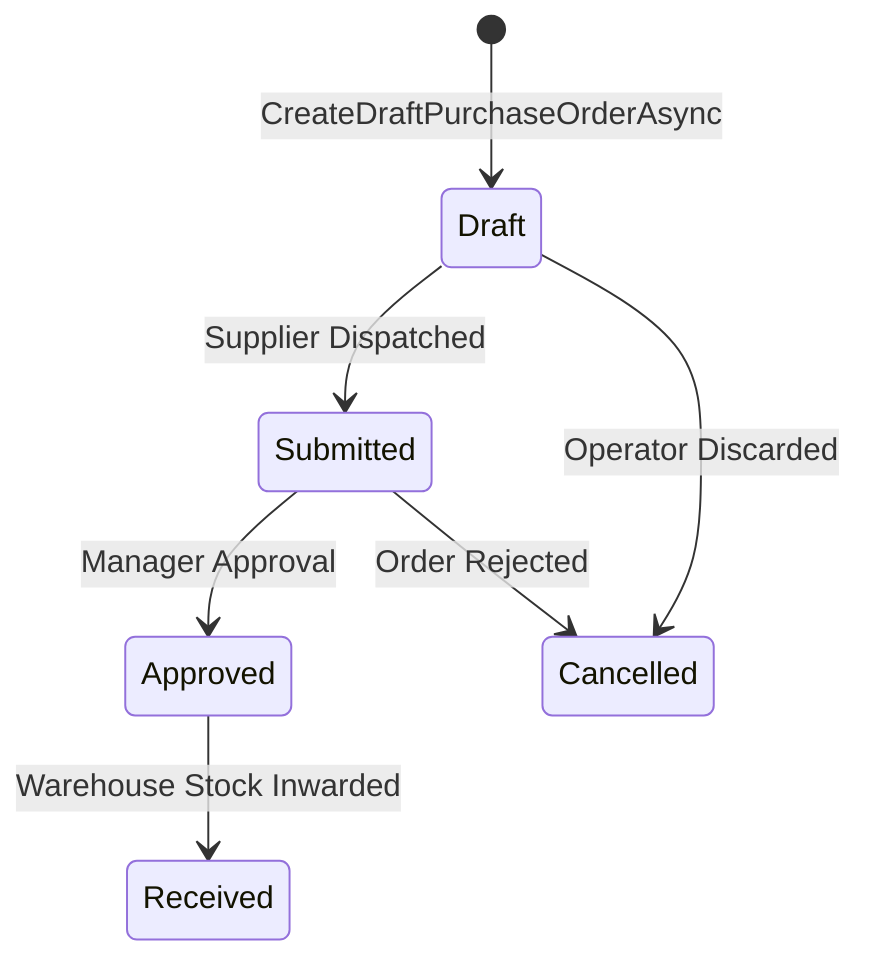

# Data Model: Automated Restocking & Purchase Order Agent Plugin

**Feature Branch**: `009-purchase-order-agent`  
**Date**: 2026-09-06  
**Status**: Completed

---

## 1. Domain Entities & Database Schema

### `PurchaseOrder` (Table: `PurchaseOrders`)
Represents a supplier procurement order issued by an authenticated tenant organization.

| Column | Type | Nullable | Description |
| :--- | :--- | :---: | :--- |
| `Id` | `uniqueidentifier` | No | Primary Key (`Guid`) |
| `TenantId` | `uniqueidentifier` | No | Foreign Key to `Tenants.Id` (Tenant isolation filter) |
| `OrderNumber` | `nvarchar(50)` | No | Formatted unique PO code (e.g., `PO-202609-0001`) |
| `SupplierName` | `nvarchar(200)` | No | Vendor or distributor name |
| `OrderDate` | `datetime2` | No | Timestamp of order creation |
| `ExpectedDeliveryDate`| `datetime2` | Yes | Anticipated warehouse delivery timestamp |
| `TotalAmount` | `decimal(18,2)` | No | Aggregate gross monetary amount |
| `Currency` | `nvarchar(10)` | No | ISO currency code (default: `USD`) |
| `Status` | `int` | No | Enum `PurchaseOrderStatus` (`Draft = 0`, `Submitted = 1`, `Approved = 2`, `Received = 3`, `Cancelled = 4`) |
| `Notes` | `nvarchar(max)` | Yes | Optional notes or AI generation rationale |
| `CreatedAtUtc` | `datetime2` | No | Audit creation timestamp |
| `UpdatedAtUtc` | `datetime2` | Yes | Audit update timestamp |
| `IsDeleted` | `bit` | No | Soft-delete flag (filtered by EF Core query filter) |

---

### `PurchaseOrderLineItem` (Table: `PurchaseOrderLineItems`)
Itemized product line items associated with a `PurchaseOrder`.

| Column | Type | Nullable | Description |
| :--- | :--- | :---: | :--- |
| `Id` | `uniqueidentifier` | No | Primary Key (`Guid`) |
| `TenantId` | `uniqueidentifier` | No | Foreign Key to `Tenants.Id` |
| `PurchaseOrderId` | `uniqueidentifier` | No | Foreign Key to `PurchaseOrders.Id` (Cascade delete) |
| `InventoryItemId` | `uniqueidentifier` | No | Foreign Key to `InventoryItems.Id` |
| `SKU` | `nvarchar(50)` | No | Product SKU code |
| `ItemName` | `nvarchar(200)` | No | Snapshot of item name at time of order |
| `Quantity` | `int` | No | Units to replenish |
| `UnitPrice` | `decimal(18,2)` | No | Unit cost per item |
| `TotalPrice` | `decimal(18,2)` | No | Computed line total (`Quantity * UnitPrice`) |
| `CreatedAtUtc` | `datetime2` | No | Audit creation timestamp |
| `UpdatedAtUtc` | `datetime2` | Yes | Audit update timestamp |
| `IsDeleted` | `bit` | No | Soft-delete flag |

---

## 2. Analytical & Result DTOs

### `LowStockAlertDto`
```csharp
public record LowStockAlertDto(
    string SKU,
    string Name,
    int StockQuantity,
    int ReorderThreshold,
    int SuggestedReorderQuantity,
    decimal UnitPrice,
    decimal EstimatedRestockCost
);
```

### `PurchaseOrderLineItemDto`
```csharp
public record PurchaseOrderLineItemDto(
    Guid Id,
    Guid InventoryItemId,
    string SKU,
    string ItemName,
    int Quantity,
    decimal UnitPrice,
    decimal TotalPrice
);
```

### `DraftPurchaseOrderResultDto`
```csharp
public record DraftPurchaseOrderResultDto(
    bool Success,
    Guid? PurchaseOrderId,
    string OrderNumber,
    string SupplierName,
    DateTime OrderDate,
    decimal TotalAmount,
    string Currency,
    string Status,
    int LineItemCount,
    List<PurchaseOrderLineItemDto> LineItems,
    string Message
);
```

---

## 3. Entity Relationships & State Machine




